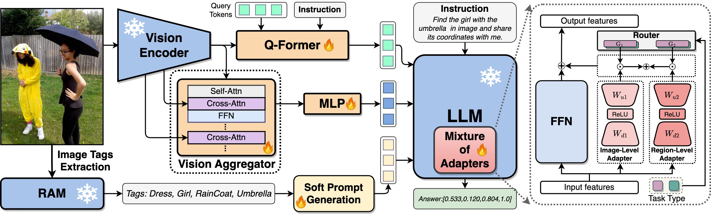
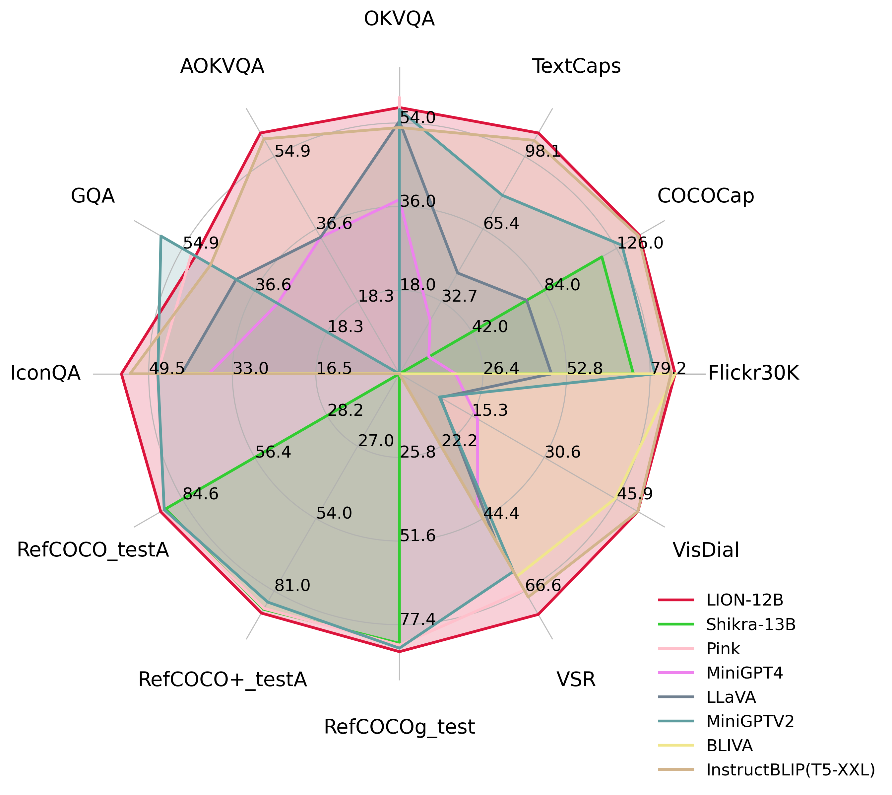
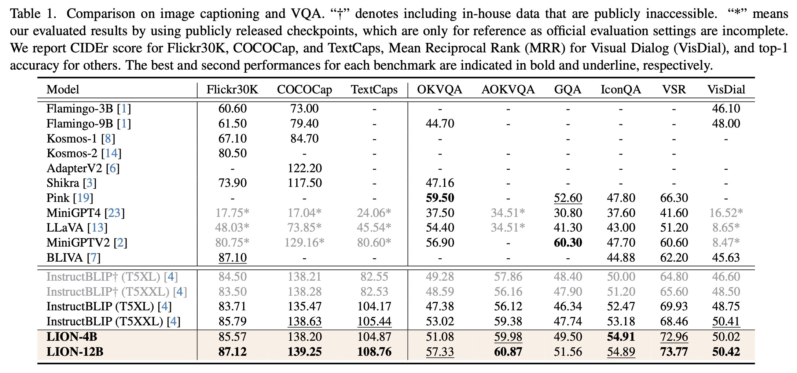
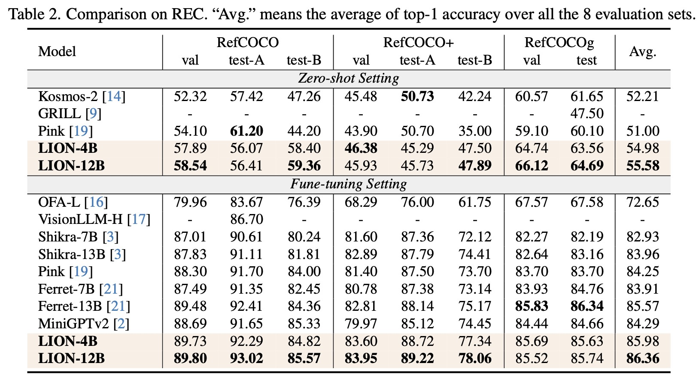
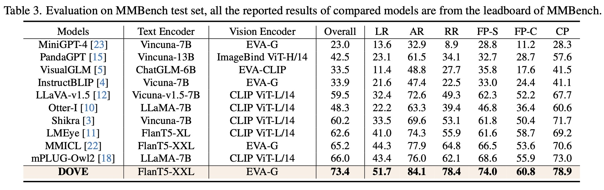
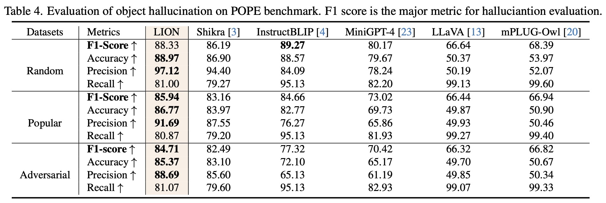
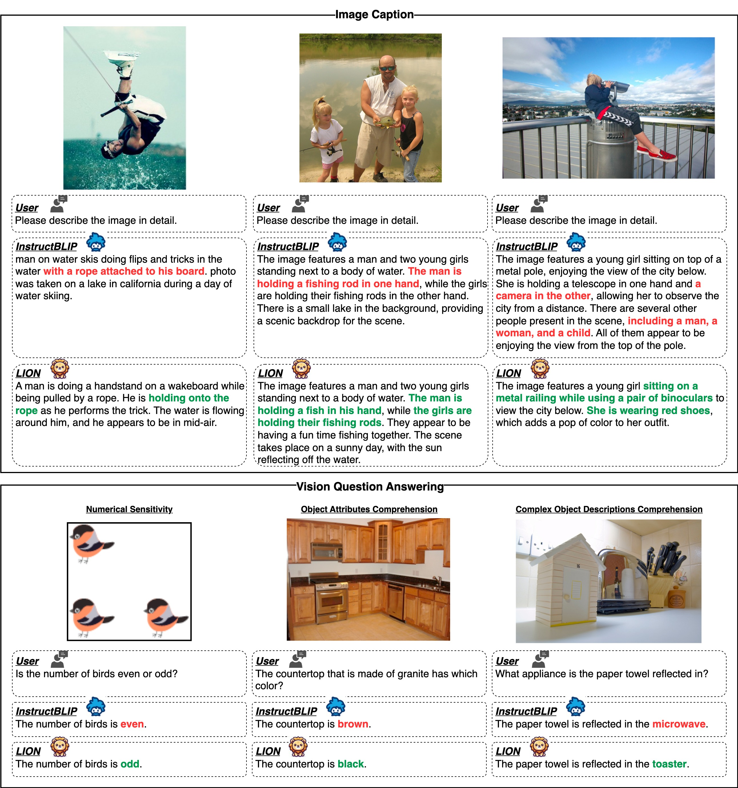
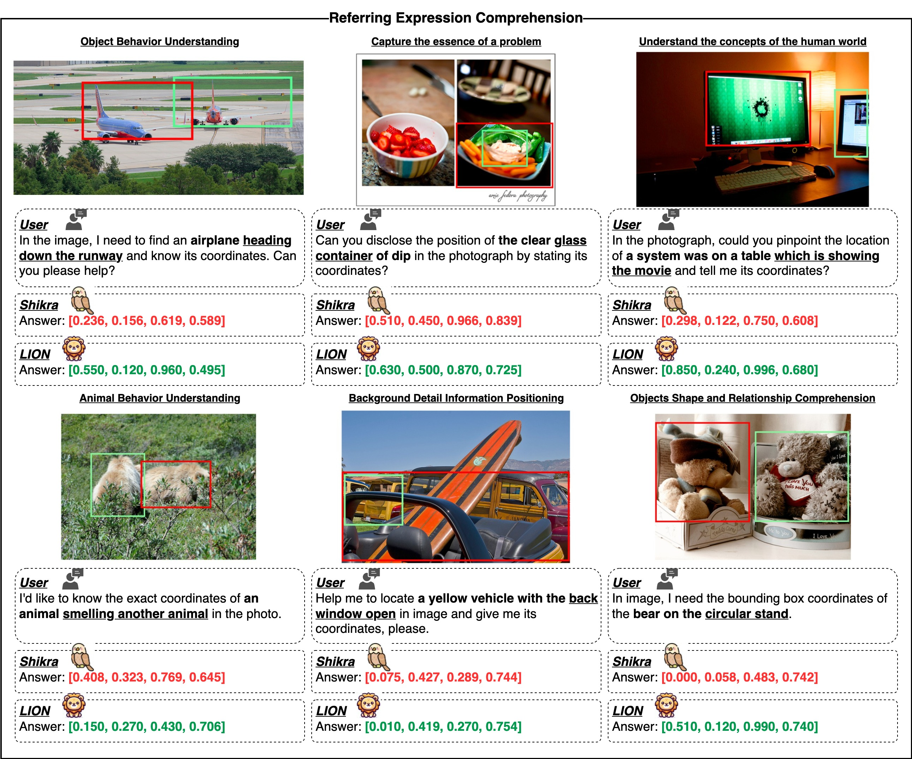
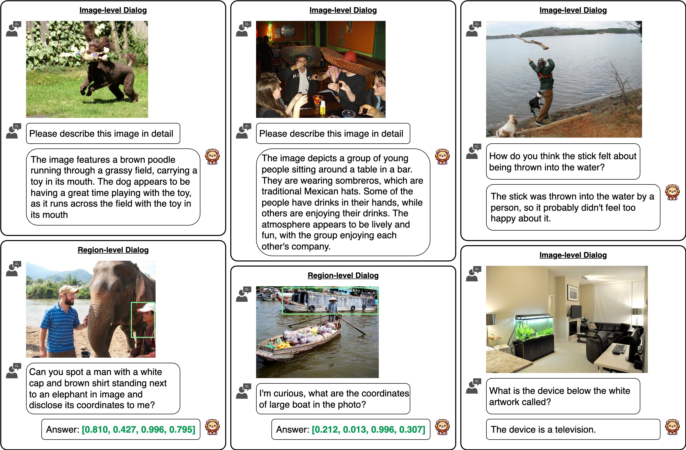

<div align="center">

<!-- <h1>JiuTian (九天) </h1> -->
<h2 class="papername">  LION: Empowering Multimodal Large Language Model with Dual-Level Visual Knowledge </h2>
<div>
<div>
    <a href="https://scholar.google.com/citations?user=Mpg0w3cAAAAJ" target="_blank">Gongwei Chen</a>,
    <a href="https://www.slywiki.cn/" target="_blank">Leyang Shen</a>,
    <a href="https://rshaojimmy.github.io/" target="_blank">Rui Shao*</a>,
    <a href="https://xiang-deng-dl.github.io/" target="_blank">Xiang Deng</a>,
    <a href="https://liqiangnie.github.io/" target="_blank">Liqiang Nie*</a>
</div>

School of Computer Science and Technology, Harbin Institute of Technology, Shenzhen<br>
*Corresponding author

IEEE Conference on Computer Vision and Pattern Recognition (CVPR) 2024

[[Paper]](https://arxiv.org/abs/2311.11860) [[Project Page]](https://rshaojimmy.github.io/Projects/JiuTian-LION) [[Video(YouTube)]](https://www.youtube.com/watch?v=YzJ5MZFS5RA) [[Video(bilibili)]](https://www.bilibili.com/video/BV1kH4y1y7UR/) 

:fire: Details will be released. Stay tuned :beers: :+1: 

[](https://hits.seeyoufarm.com)

</div>
<br>
  


</div>

## If you find this work useful for your research, please kindly cite our paper and star our repo.

## Updates
- [02/2024] LION has been accepted by CVPR 2024.
- [11/2023] [Arxiv paper](https://arxiv.org/abs/2311.11860) released.
- [11/2023] [Project page](https://rshaojimmy.github.io/Projects/JiuTian-LION) released.

## Introduction

This is the github repository of *LION : Empowering Multimodal Large Language Model with Dual-Level Visual Knowledge*. In this work, we enhance MLLMs by integrating fine-grained spatial-aware visual knowledge and high-level semantic visual evidence, boosting capabilities and alleviating hallucinations.

The framework of the proposed LION model:

<div align="center">

</div>

## Evaluation results

 For <b>image-level</b> tasks, we focus on image captioning and Visual Question Answering (VQA). For <b>region-level</b> tasks, we evaluate LION on three REC datasets including RefCOCO, RefCOCO+ and RefCOCOg. The results, detailed in Table 1~2, highlight LION's superior performance compared to baseline models.






We further evaluate LION on a object hallucination benchmark([POPE](https://github.com/AoiDragon/POPE)) and the most popular MLLM benchmark ([MMBench](https://mmbench.opencompass.org.cn/home)). The results in Table 1~2 show that LION has strong performances across various skills and also demonstrates a strong resistance to hallucinations, particularly in popular and adversarial settings in POPE.




## Qualitative Comparison





## More Examples


## Citation

If you find this work useful for your research, please kindly cite our paper:
```
@inproceedings{chen2024lion,
    title={LION: Empowering Multimodal Large Language Model with Dual-Level Visual Knowledge}, 
    author={Chen, Gongwei and Shen, Leyang and Shao, Rui and Deng, Xiang and Nie, Liqiang},
    booktitle={IEEE Conference on Computer Vision and Pattern Recognition (CVPR)},
    year={2024}
}
```
