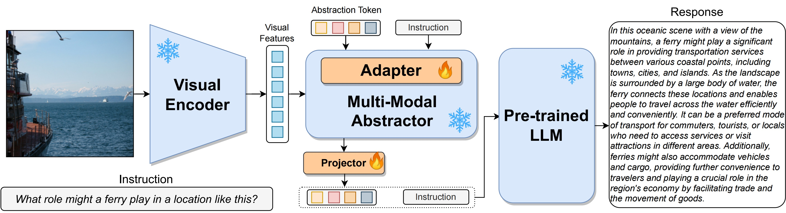

# JiuTian

<h1>JiuTian (九天) </h1>

:fire: Details will be released. Stay tuned :beers: :+1: 

 
  

## Training Data
|Dataset|Size|Pretraining|Instruction Tuning|
|:-|:-:|:-:|:-:|
|[LAION](https://laion.ai/)(*)|100M| :white_check_mark:
|[COCOCN](https://github.com/li-xirong/coco-cn)|27K|:white_check_mark:|
|[MIMIC-IT](https://github.com/Luodian/Otter/blob/main/mimic-it/README.md)(**)|1.2M||:white_check_mark:
|[LRV](https://fuxiaoliu.github.io/LRV/)|20K||:white_check_mark:
|[LLaVAR](https://llavar.github.io/)|158K||:white_check_mark:
|[TextCap](https://textvqa.org/textcaps/)|21K||:white_check_mark:
|[VQA v2.0](https://visualqa.org/)|82K||:white_check_mark:
|[GQA](https://github.com/stanfordnlp/mac-network)|148K||:white_check_mark:
|[IconQA](https://iconqa.github.io/)|19K||:white_check_mark:
|[OK-VQA](https://okvqa.allenai.org/)|9K||:white_check_mark:
|[A-OKVQA](https://allenai.org/project/a-okvqa/home)|17K||:white_check_mark:

Notes:
*: using our designed rules to filter the original data;
**: only including its open source part